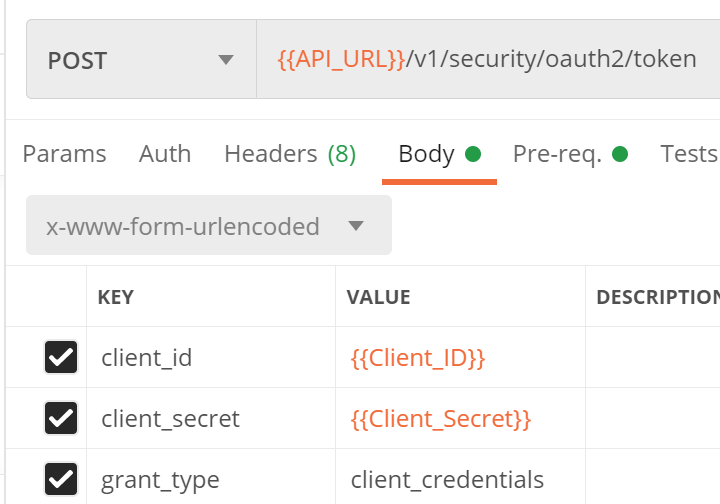

# 实现步骤

## 1. Token



## 2. search 1

### 请求

- 要求必须为3天

  ```json
  {
      "currencyCode": "{{currencyCode}}",
      "originDestinations": [
          {
              "id": "1",
              "originLocationCode": "{{originLocationCode}}",
              "destinationLocationCode": "{{destinationLocationCode}}",
              "departureDateTimeRange": {
                  "date": "{{departureDate}}",
                  "dateWindow": "{{dateWindow}}"	# 这里是3天窗口期
              }
          },
          {
              "id": "2",
              "originLocationCode": "{{destinationLocationCode}}",
              "destinationLocationCode": "{{originLocationCode}}",
              "departureDateTimeRange": {
                  "date": "{{returnDate}}",
                  "dateWindow": "{{dateWindow}}"	# 这里是3天窗口期
              }
          }
      ],
      "travelers": [							# 4个旅客
          {
              "id": "1",
              "travelerType": "ADULT",		# 成人
              "fareOptions": [
                  "STANDARD"
              ]
          },
          {
              "id": "2",
              "travelerType": "ADULT",		# 成人
              "fareOptions": [
                  "STANDARD"
              ]
          },
          {
              "id": "3",
              "travelerType": "CHILD",		# 儿童
              "fareOptions": [
                  "STANDARD"
              ]
          },
          {
              "id": "4",
              "travelerType": "HELD_INFANT",	# 婴儿
              "fareOptions": [
                  "STANDARD"
              ],
              "associatedAdultId": "1"
          }
      ],
      "sources": [
          "GDS"
      ],
      "searchCriteria": {
          "pricingOptions": {
              "fareType": [
                  "PUBLISHED"
              ],
              "includedCheckedBagsOnly": false
          },
          "additionalInformation": {
              "chargeableCheckedBags": false,
              "brandedFares": true
          }
      }
  }
  ```

  

### 响应

- 选择 "data" 数组中任一 "id"对象作为 search2 的 "flightOffer" 输入	

## 3. search 2

### 请求

- 要求必须为1天

### 响应

- 依旧选择之前的 "id"对象作为 pricing 的 "flightOffer" 输入	


## 4. pricing

### 请求

- 选择之前的 "id"对象作为 pricing 的 "flightOffer" 输入

### 响应	

### 5. order

- 选择之前的 "id"对象作为 pricing 的 "flightOffer" 输入

- 带上乘客信息