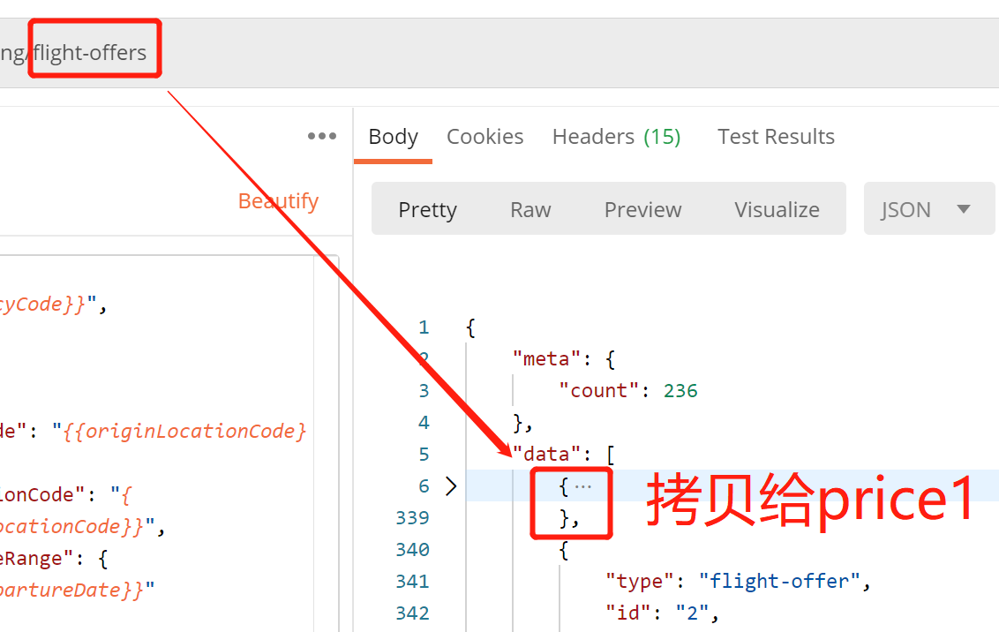
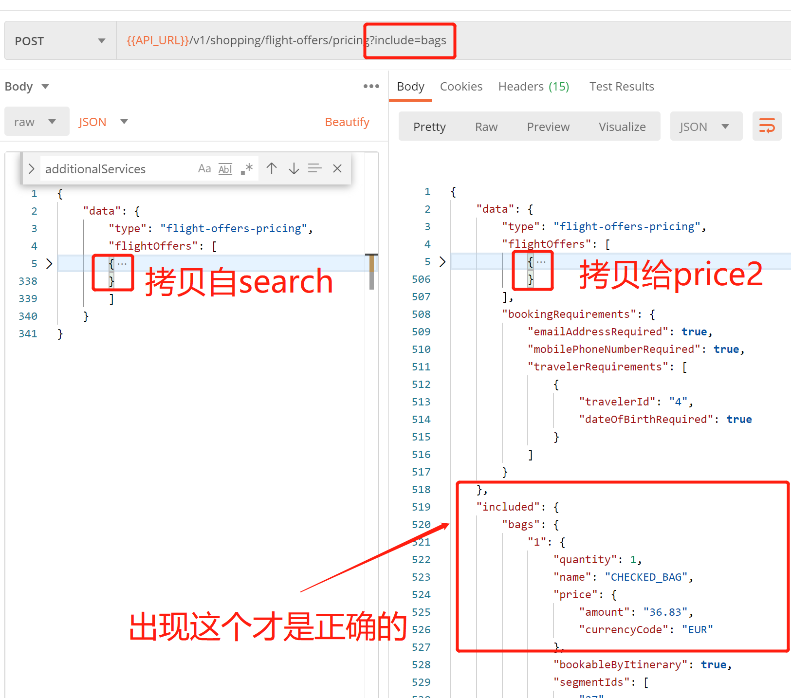

# 整体步骤

## 1. Token 同 case1

## 2. search

### 请求

- 要求必须为1天
- 带上加包裹信息: `"chargeableCheckedBags": true,`

### 响应

- 寻找结果中带有 additionalServices 的数组的整体id信息，作为pricing1的中的 flightOffers 数组的数据。

- additionalServices的结果类似如下：

```json
"additionalServices": [
	{
		"amount": "36.83",
		"type": "CHECKED_BAGS"
	}
]
```

> 注意，这个additionalServices是带价格的哦。

### 图例

- 拷贝给pricing1

		

## 3. pricing1

### 请求

- 链接上带有 ?include=bags

- 选择任何一个从 search 步骤中的response结果中，带有 additionalServices 的数组，作为此次请求的id。

### 响应

出现如下类似的信息，说明请求成功。

```json
"included": {
	"bags": {
		"1": {
			"quantity": 1,
			"name": "CHECKED_BAG",
			"price": {
				"amount": "36.83",
				"currencyCode": "EUR"
			},
			"bookableByItinerary": true,
			"segmentIds": [
				"27",
				"28",
				"81",
				"82"
			],
			"travelerIds": [
				"1",
				"2",
				"3"
			]
		}
	}
},
```

> 注意，pricing 1的 flightOffers 结果中，additionalServices 已经是没有的了。

### 图例

- 拷贝给pricing2

	


## 4. pricing2

### 请求

- 链接上去掉 ?include=bags
- 从pricing1中结果中的 flightOffers 的数组，拷贝到当前请求的 filightOffers数组的数据。
- 在 "price"项中添加子项  "additionalServices"， 即实际包裹的费用。

```json
"additionalServices": [
	{
		"amount": "221.04",
		//221.04 = 36.84(单程包裹费用) * 3(可携带包裹人数，无婴儿) * 2(双程)   
		"type": "CHECKED_BAGS"
	}
]
```

- 计算总价

	当前 "grandTotal": "598.21" 的值为 598.21
	需要加上包裹的费用 221.04
	新的 "grandTotal" 的取值为 819.25 。

- 在 "fareDetailsBySegment" 子项中添加：

```json
"additionalServices": {
	"chargeableCheckedBags": {
		"quantity": 1
	}
}
```

> 注意，这个 additionalServices 跟  search 结果中的 additionalServices 可是不一样的哦。

### 5. order 同 case1

- 将pricing2中返回的结果中的 flightOffers 数组内容，直接拷贝到 当前order请求的 flightOffers 的数组中即可。
