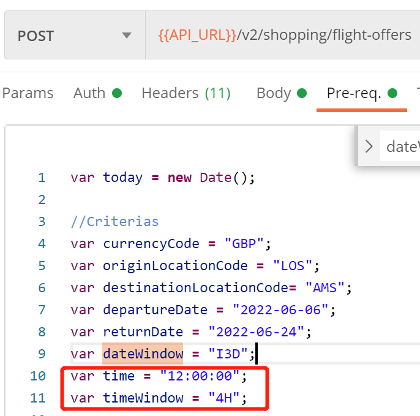
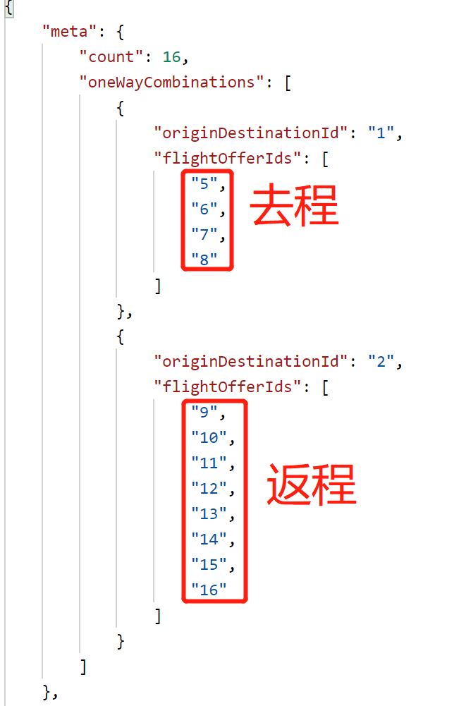

# 实现步骤

## 1. Token 同 case1

## 2. search

### 请求

- 窗口期可按需缩短

  

  ```json
  {
  	"originDestinations": [
  		{
  			"id": "1",
  			"originLocationCode": "{{originLocationCode}}",
  			"destinationLocationCode": "{{destinationLocationCode}}",
  			"departureDateTimeRange": {
  				"date": "{{departureDate}}",
  				"time": "{{time}}",
  				"timeWindow": "{{timeWindow}}"
  			}
  		},
  		{
  			"id": "2",
  			"originLocationCode": "{{destinationLocationCode}}",
  			"destinationLocationCode": "{{originLocationCode}}",
  			"departureDateTimeRange": {
  				"date": "{{returnDate}}",
  				"time": "{{time}}",
  				"timeWindow": "{{timeWindow}}"
  			}
  		}
  	]
  }
  ```

### 响应

- 获取到去程和返程信息

  

> 之所以会选择这些id，是因为这些id中都是  `"oneWay": true,`

- 选择 "data" 数组中对应的去程"id"和返程"id", 作为 pricing 的 "flightOffers" 的输入。

## 3. pricing

### 请求

- 选择search步骤中的"data" 数组中对应的去程"id"和返程"id", 作为 pricing 的 "flightOffers" 的输入。

### 响应

- 选择 "flightOffers" 数组中对应的去程"id"和返程"id", 作为 order 的 "flightOffers" 的输入

### 5. order

- 选择之前的 "id"对象作为 pricing 的 "flightOffer" 输入

- 带上乘客信息

- 带上支付信息

  ```json
  {
  	"formOfPayments": [
  		{
  			"other": {
  				"method": "CASH",
  				"flightOfferIds": [
  					"5"
  				]
  			}
  		},
  		{
  			"other": {
  				"method": "CASH",
  				"flightOfferIds": [
  					"9"
  				]
  			}
  		}
  	]
  }
  ```

  
